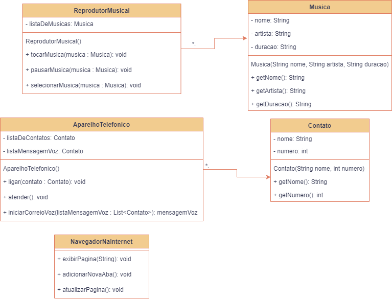

# Representação de componentes do IPhone

### Modelagem em UML e código que representam componentes do IPhone

Índice
=================

   * [Sobre](#Sobre)
   * [UML](#UML)
   * [Tecnologias](#Tecnologias)

# Sobre 
Esse projeto faz parte de um desafio do "Bootcamp Santander Bootcamp 2023 - Backend Java".

Com base no vídeo de lançamento do IPhone conforme link abaixo, foram elaboradas a diagramação das classes
com a proposta de representar os papéis do IPhone de: Reprodutor Musicial, Aparelho Telefônico e Navegador na Internet. Em seguida foram feitas as classes em arquivos .java.

[Lançamento iPhone 2007](https://www.youtube.com/watch?v=9ou608QQRq8)

##### Comportamentos esperados:
* Repodutor Musicial: tocar, pausar, selecionarMusica
* Aparelho Telefônico: ligar, atender, iniciarCorrerioVoz
* Navegador na Internet: exibirPagina, adicionarNovaAba, atualizarPagina
---

# UML

# Tecnologias
- Java
- UML
- Git e Github